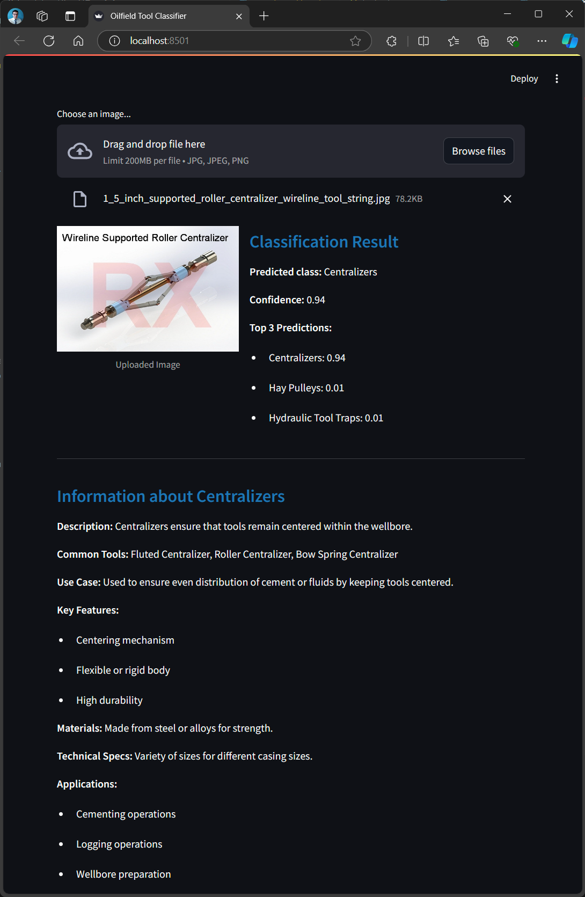
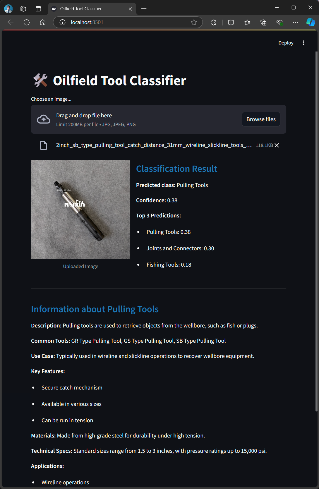
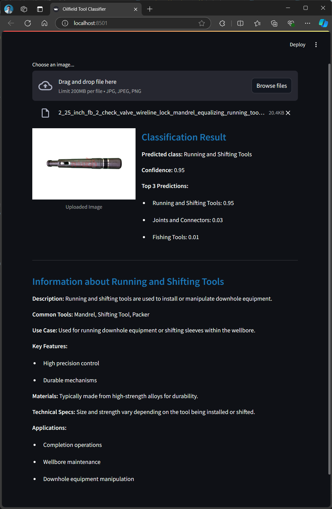

# Luna-ImageDetection: Slickline Tool Recognition

This project aims to recognize slickline tools in unlabeled photos using machine learning techniques. It leverages computer vision and deep learning to automate the identification of various slickline tools used in the oil and gas industry.

## Project Structure

- `src/`: Contains the source code for the project.
- `data/`: Directory for storing image data (not tracked by Git).
- `models/`: Directory for storing trained models (not tracked by Git).
- `app/`: Streamlit app for tool prediction and visualization of results.

## Setup (Using Docker)

1. Clone the repository:
   ```bash
   git clone https://github.com/OilCoder/Luna-ImageDetection.git
   cd Luna-ImageDetection
   ```
   
2. Build and run the Docker container:
   ```bash
   docker build -t luna-imagedetection .
   docker run --gpus all -v $(pwd):/workspace -it luna-imagedetection
   ```

3. Access the container and navigate to the workspace:
   ```bash
   cd /workspace
   ```

4. Install any additional dependencies if required:
   ```bash
   pip install -r requirements.txt
   ```

## Usage

### 1. Data Preparation, Training, and Evaluation
To prepare data, train the model, and evaluate its performance:
```bash
python src/main.py
```

### 2. Streamlit App for Prediction and Tool Report
Luna-ImageDetection now includes a **Streamlit** app that allows users to upload an image and receive a prediction along with a detailed report of the predicted tool.

To run the Streamlit app:
```bash
streamlit run src/app_streamlit.py
```

#### Example:
- **Input**: Upload an image of a slickline tool (e.g., valve, pull tool, etc.).
- **Output**: The app predicts the type of tool and provides a visual report.

Here are some example predictions:

- **Centralizer Example**:
  

- **Pulling Tool Example**:
  

- **Valve Example**:
  

The app displays a clear and concise report after processing the image, which is useful for reviewing the model's prediction performance in real-time.

## Contributing

Contributions to improve Luna-ImageDetection are welcome. Please feel free to submit a Pull Request.

## License

[License information to be added]

## About the Author

This project is maintained by Carlos Esquivel, a specialist in applying machine learning techniques to petrophysical data. For more projects related to oil and gas industry data analysis, visit [github.com/OilCoder](https://github.com/OilCoder).
